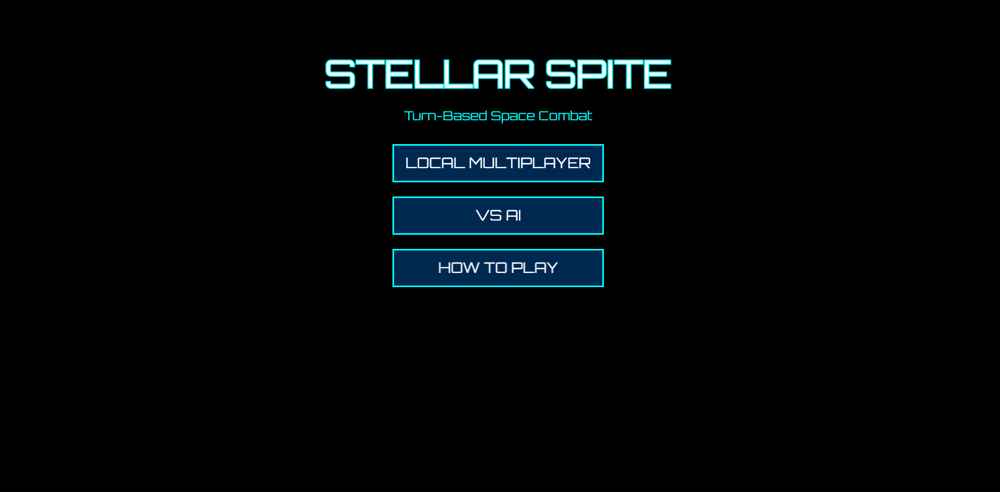
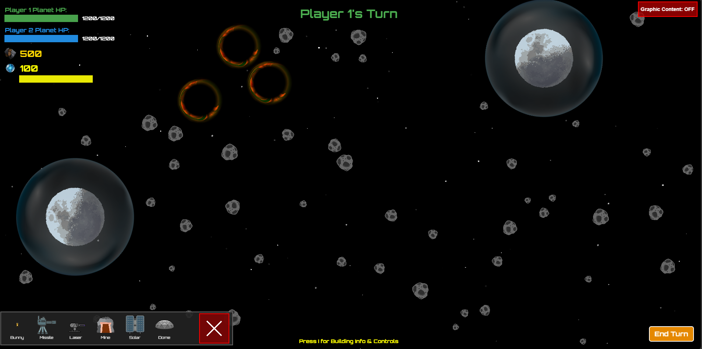
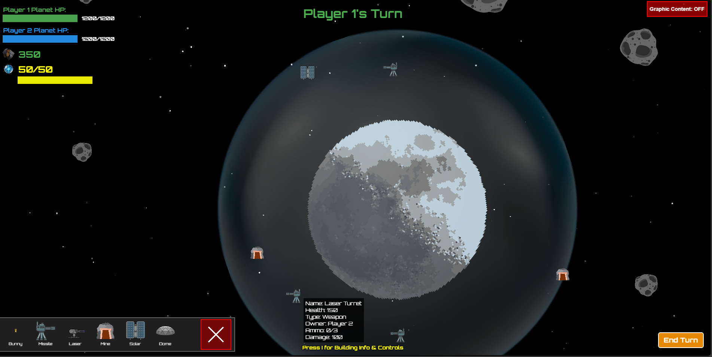

# Stellar Spite

> *A turn-based strategy artillery game where petty neighbors escalate their dispute to orbital warfare*



## About

What started as a simple disagreement over loud music and a borrowed cup of antimatter has spiraled into all-out space war. Build your fortress, manage resources, and rain destruction on your neighbor's base—all while navigating complex gravity fields from planets, asteroids, and black holes.

**Space Fortress Warfare** combines the precision shooting of *Worms*, the resource management of tower defense games, and the orbital mechanics of space physics into one strategic package.

## Features

### Strategic Building System
- **Ore Mines**: Generate resources for building your arsenal
- **Solar Panels**: Increase your energy capacity for actions
- **Dome Shields**: Protect your base and define your territory
- **Turrets**: Automated defense with missile launchers and laser cannons

### Physics-Based Combat
- **Gravity Wells**: Planets, asteroids, and black holes bend projectile trajectories
- **Particle Trails**: Visualize your shots as they curve through space
- **Destructible Bases**: Chip away at enemy health to achieve victory

### Game Modes
- **Local Multiplayer**: Face off against a friend on the same device
- **VS AI**: Battle against an intelligent opponent that builds, defends, and attacks strategically

### Resource Management
- Start with limited ore and energy—build wisely!
- Mines generate ore over time
- Solar panels expand your energy capacity
- Every action costs energy—plan your turns carefully

## How to Play

### Controls
- **Build Structures**: Drag building icons from the toolbar onto the grid
- **Aim & Fire**: Click and drag from a turret to set trajectory and power
- **End Turn**: Click "End Turn" button when you're done
- **Pan Camera**: Drag the background to move around
- **Zoom**: Scroll wheel to zoom in/out

### Building Guide
| Building | Cost | Effect |
|----------|------|--------|
| Ore Mine | 50 ore | Generates 20 ore per turn |
| Solar Panel | 75 ore | +50 max energy capacity |
| Dome Shield | 200 ore | Protects base, defines build radius |
| Turret | 150 ore | 3 ammo, 250 damage, 50 energy/shot |
| Laser Turret | 100 ore | 5 ammo, 100 damage, 25 energy/shot |

### Strategy Tips
1. **Build shields early** to protect your base and expand your build radius
2. **Balance economy and offense** - mines fuel your war machine
3. **Watch the gravity wells** - use them to curve shots around obstacles
4. **Manage energy carefully** - you can't shoot if you run out!
5. **Place turrets strategically** within your shield radius

## Getting Started

### Prerequisites
- Node.js 16+ and npm

### Installation

```bash
# Clone the repository
git clone https://github.com/notSam25/TigerHack25.git
cd TigerHack25

# Install dependencies
npm install

# Run development server
npm run dev
```

The game will open at `http://localhost:5173`

### Building for Production

```bash
npm run build
npm run preview
```

## Screenshots

### Main Menu


### Default Game Map


### Strategic Building Placement


## Tech Stack

- **PixiJS v8**: High-performance 2D rendering
- **TypeScript**: Type-safe game logic
- **Vite**: Lightning-fast build tool
- **Web Audio API**: Sound effects and audio management

## Game Design

### Story
In the distant future, humanity has colonized space. But even among the stars, neighbors find reasons to fight. What began as a noise complaint has evolved into a full-scale orbital artillery battle. Two fortresses. Infinite pettiness. Zero chill.

### Unique Mechanics
- **Shield Placement System**: Buildings can only be constructed within your dome shield's radius
- **Gravity Simulation**: Real-time trajectory calculation through multiple gravity sources
- **Smart AI**: The computer opponent simulates trajectories, avoids friendly fire, and manages resources strategically
- **Turn-Based Strategy**: Plan your economy and military moves each turn

## License

This project was created for TigerHack 2025.

## Future Enhancements

- [ ] Online multiplayer
- [ ] Modular building
- [ ] Additional building types (railguns, repair drones)

## Acknowledgments

Made By:
- Bradley Thornton ([@bradleymt](https://github.com/bradleymt))
- Samuel Wiseman ([@notSam25](https://github.com/notSam25))


---

*"In space, everyone can hear you argue about parking spaces."*
